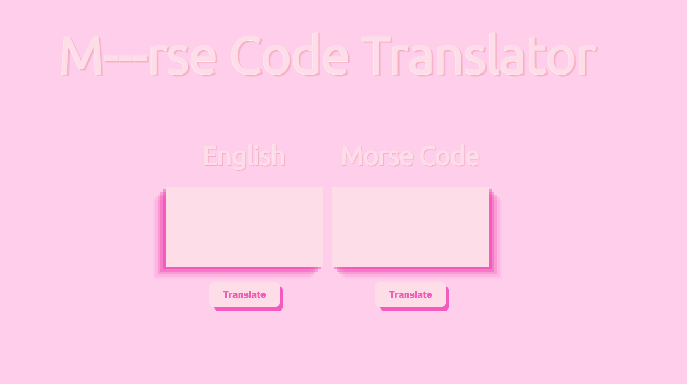

# morse-code-translator

This project aimed to translate between Morse Code and English using javascript. The code was split into data, logic and dom functions.

Unit tests were developed for the logic functions.

After reaching the MVP, text language detection and more characters were added. Still more work to be done to get these functions working fully.

